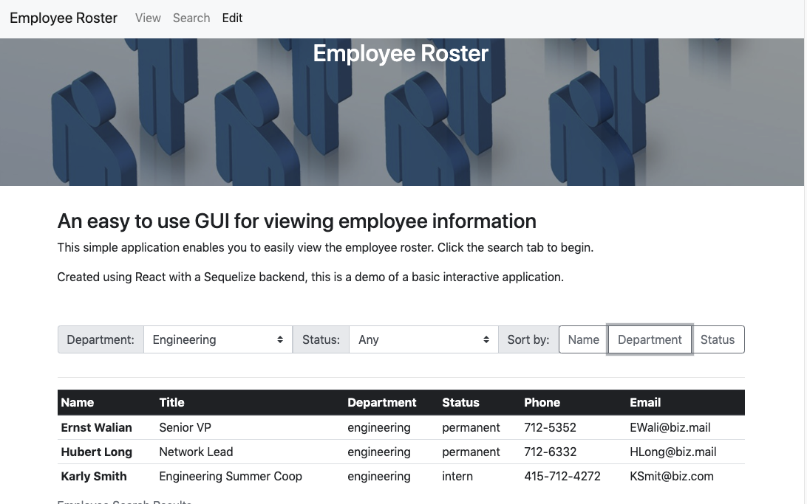
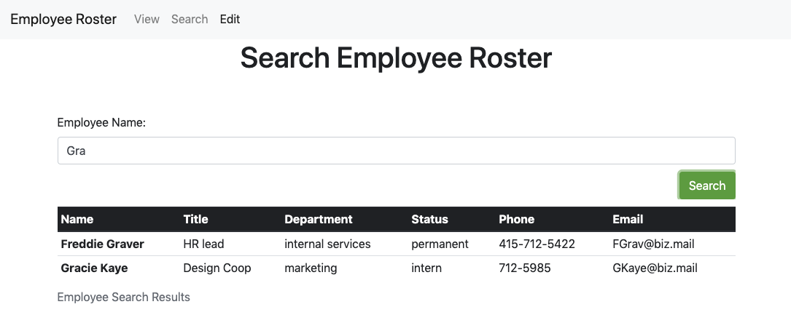
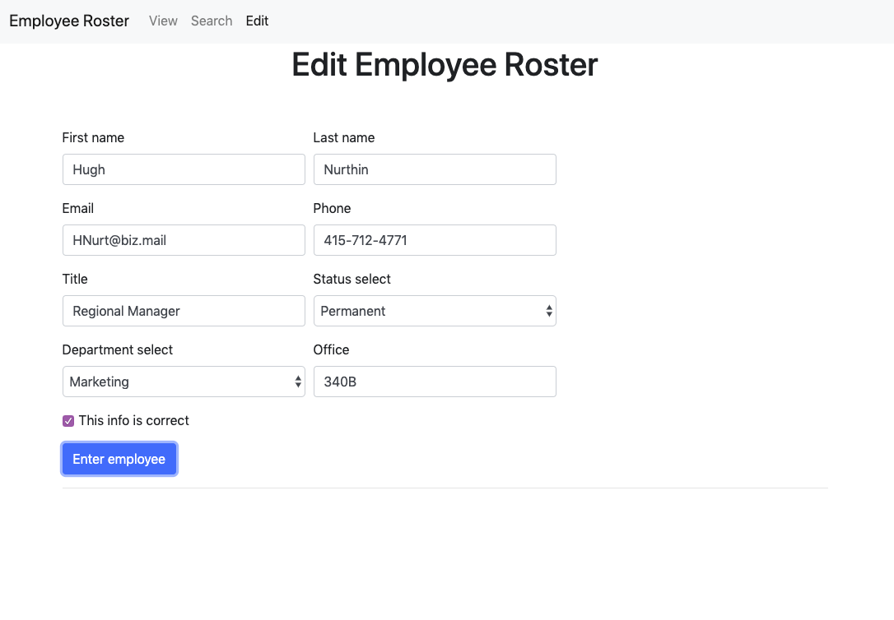

<!-- //////////////////////////// -->
# Unit 19 React Homework: Employee Directory
### An employee directory with React

This was my first exercise and practie working with react, responding to user input and updating state. It allows for a user to explore an employee roster through filtering, sorting, and searching.

## Viewing and using the website
Follow the link to the deployed application above, or 

- Clone and Download the repo
- Install the node dependencies:
`npm instal`
- Initialize the MySQL database (seed optional):
- Initalize the server
`npm start`

Here is an example of the front end application view/home page:

You can also search employees:

And add employees to the database to search/sort:

All website assets are contained within the repo (https://github.com/anzook/Employee-Directory)

## Acknowledgements and Credits

Website created as an assignment for the Johns Hopkins full-stack web development bootcamp (in partnership with Trilogy Education Services).
Guidance and assistance provided by:
* Stetson Lewis (Instructor)
* Donald Hesler (TA)
* Dan Thareja (Inspiration)